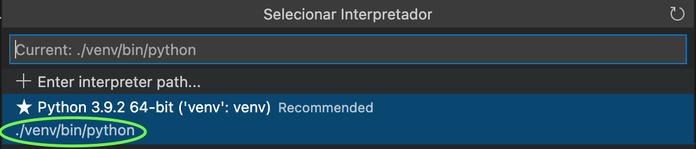

# Desenvolvimento orientado a testes com Python e Django

Esse roteiro é o material de apoio para o tutorial apresentado na Python Brasil 2021 ([por mim](http://instagram.com/gabrielsaldanha.dev)!) e é baseado no livro ["Test-Driven Development with Python" de Harry Percival](https://amzn.to/3oXIf7t), que pode ser [comprado na Amazon](https://amzn.to/3lBcXRU) ou [lido gratuitamente online](https://www.obeythetestinggoat.com/).

---

***Bio*:** Gabriel Saldanha, formado em Ciência da Computação pela UFF (Niterói–RJ). Atualmente trabalho como Engenheiro de Software na Carta – **[estamos contratando](https://grnh.se/f3f1290e3)**!

---

> *“É um negócio perigoso, Frodo, sair pela porta de casa. Você coloca um pé na estrada, e se você não se manter firme, não tem como saber para onde será levado.”*
> 

*Bilbo Baggins*.

---

# Repositório

Cada seção desse tutorial está em uma respectiva branch no meu repositório do GitHub.

```bash
git clone git@github.com:gcrsaldanha/tdd-pybr2021
cd tdd-pybr2021
git checkout 1-configurando-o-ambiente
```

# 1. Configurando o ambiente

- Instalar [**Python 3+**](https://www.python.org/downloads/) (qualquer versão a partir do 3.6 deve funcionar)
    - Executar no terminal: `python --version` ou `python3 --version`
- Instalar [**Google Chrome**](https://www.google.com/intl/pt-BR/chrome/)
- Criar uma pasta chamada "***tdd-pybr2021***" e ***virtualenv***
    
    ```bash
    mkdir tdd-pybr2021
    cd tdd-pybr2021
    python3 -m venv venv  # dentro da pasta tdd-pybr2021
    source venv/bin/activate  # No Mac/Linux
    ```
    
    - *virtualenv* no **Windows**
        
        Segundo a [documentação oficial](https://docs.python.org/pt-br/3/library/venv.html):
        
        - PowerShell: `venv\Scripts\Activate.ps1`
        - Cmd.exe: `venv\Scripts\activate.bat`
    
    Caso você utilize o terminal integrado de sua IDE/Editor, não esqueça de selecionar o interpretador Python do **ambiente virtual**.
    
    - Exemplo com **VSCode**
        
        
        
- Instalar ***Selenium** e **Chromedriver***
    - Para instalar o **selenium**, basta executar:
    
    ```bash
    pip install selenium  # Não esqueça de ativar o *virtualenv* antes!
    ```
    
    - Para "instalar" o *chromedriver*, verifique a versão do seu Google Chrome em `chrome://version`
    - Baixar o *chromedriver* compatível com o seu navegador na [página de downloads](https://chromedriver.chromium.org/downloads).
    - Mover o binário do *chromedriver* para uma pasta conhecida
        
        Eu gosto de colocar dentro do `virtualenv`: **venv/bin/chromedriver**
        
- Verificar instalação do **selenium** com o *python shell*
    
    ```python
    from selenium import webdriver
    # Se o binário do chromedriver estiver em 
    browser = webdriver.Chrome(executable_path='chromedriver')
    browser.get('http://google.com')
    consulta = driver.find_element_by_name('q')
    
    from selenium.webdriver.common.keys import Keys
    consulta.send_keys('python brasil 2021')
    consulta.send_keys(Keys.ENTER)
    ```
    
    - Caso tenha problemas para executar o Selenium ❌
        - Erro: *`Message: 'chromedriver' executable needs to be in PATH.`*
            
            Binário do `chromedriver` não foi encontrado. Verifique o PATH – utilize o path completo se necessário(`/Users/seuusuario/tdd-pybr2021/venv/bin/chromedriver`)
            
        - Erro: `Message: unknown error: cannot find Chrome binary`
        
        ```python
        # Exemplo no Windows
        from selenium.webdriver.chrome.options import Options
        
        options = Options()
        options.binary_location = 'C:\Program Files\Google\Application\chrome.exe'
        
        browser = webdriver.Chrome(
        	executable_path='./venv/chromedriver.exe',
        	options=options
        )
        
        ```
        

# 2. Escrevendo o primeiro teste

Todos os comandos estão assumindo que o **virtual env está ativado** e que estamos dentro da **raiz do projeto:** `tdd-pybr2021/`

- Testar instalação do Django com selenium
    
    ```python
    # functional_tests.py
    from selenium import webdriver
    
    browser = webdriver.Chrome('chromedriver')
    browser.get('http://localhost:8000')
    
    assert 'django' in browser.title
    ```
    
    ```bash
    python functional_tests.py
    # > Message: unknown error: net::ERR_CONNECTION_REFUSED
    ```
    
    🥳 Temos o nosso primeiro teste!
    
- Criar projeto Django e iniciar servidor web 🌐
    
    ```bash
    pip install Django
    django-admin startproject listadetarefas .  # Atenção para o "." (ponto)!!!
    python manage.py runserver
    # Starting development server at http://127.0.0.1:8000/
    ```
    
    - Estrutura de pastas do projeto
        
        
        
    
    Em outra janela, executar o teste novamente:
    
    ```bash
    python functional_tests.py
    # AssertionError !!!
    ```
    
- Melhorando nossa mensagem de erro
    
    ```python
    # functional_tests.py
    
    assert 'django' in browser.title, f'browser.title: {browser.title}'
    ```
    
    ```python
    python functional_tests.py
    # AssertionError: browser.title: The install worked successfully! Congratulations!
    ```
    
- Corrigir o teste ✅
    
    ```python
    # functional_tests.py
    from selenium import webdriver
    
    browser = webdriver.Chrome('chromedriver')
    browser.get('http://localhost:8000')
    
    assert 'The install worked successfully! Congratulations!' in browser.title, (
        f'browser.title: {browser.title}'
    )
    ```
    
    ```bash
    python functional_tests.py
    # Passou!
    ```
    
- Atualizar teste para nossa aplicação "Lista de Tarefas" 📝
    
    ```python
    # functional_tests.py
    ...
    assert 'Lista de Tarefas' in browser.title, f'browser.title: {browser.title}'
    ```
    

# 3. Melhorando nossa suíte de testes

Features:

- Fechar o navegador automaticamente
- Assertions e mensagens de erro mais claras (automaticamente)
- Testes mais organizados (por caso)
- Refatorar testes com ***unittest***
    
    ```python
    # functional_tests.py
    
    import unittest
    from selenium import webdriver
    
    class TestPaginaInicial(unittest.TestCase):
        def setUp(self):
            self.browser = webdriver.Chrome('chromedriver')
    
        def tearDown(self) -> None:
            self.browser.quit()
    
        def test_pagina_inicial(self):
            self.browser.get('http://localhost:8000')
            self.assertIn(
                'Lista de Tarefas',
                self.browser.title
            )
    
    if __name__ == '__main__':
        unittest.main()
    ```
    
    ```bash
    (venv) ➜  tdd-pybr2021 python functional_tests.py
    F
    ======================================================================
    FAIL: test_acessa_pagina_inicial (__main__.TestPaginaInicial)
    ----------------------------------------------------------------------
    Traceback (most recent call last):
      File "/Users/gcrsaldanha/tdd-pybr2021/functional_tests.py", line 16, in test_acessa_pagina_inicial
        self.assertIn(
    AssertionError: 'Lista de Tarefas' not found in 'The install worked successfully! Congratulations!'
    
    ----------------------------------------------------------------------
    Ran 1 test in 2.592s
    
    FAILED (failures=1)
    ```
    

# 4.Testes funcionais e testes unitários

Testes Funcionais testam a aplicação do ponto de vista de um usuário. Geralmente *User Stories* (Histórias de Usuário) podem ser "mapeadas" para testes funcionais.

> *Terminologia: Teste Funcional == Teste de Aceitação == Teste Fim-a-Fim*
> 
- *User Story*
    
    ```python
    # functional_tests.py
    
    import unittest
    from selenium import webdriver
    
    class TestPaginaInicial(unittest.TestCase):
        def setUp(self):
            self.browser = webdriver.Chrome('chromedriver')
    
        def tearDown(self) -> None:
            self.browser.quit()
    
        def test_pagina_inicial(self):
    				# Maria ouviu falar de um novo site de lista de tarefas (To-Do Lists)
    				# Ela acessa a página inicial e vê "Lista de Tarefas"
            self.browser.get('http://localhost:8000')
            self.assertIn(
                'Lista de Tarefas',
                self.browser.title
            )
    				# Ela percebe que há um cabeçalho escrito "Tarefas".
    
    				# Abaixo deste cabeçalho, há um campo em branco (input field) 
    				# para inserir uma nova tarefa.
    				
    				# Ela digita "Comprar livro de TDD" 
    				
    				# Ao apertar enter, **um novo item numerado aparece** na lista
    
    				# Maria então **adiciona uma nova tarefa**: "Terminar palestra de Pyhton" (**numerada como 2**).
    				# Maria percebe que ao lado de cada tarefa há **3 opções** (indicadas por ícones):
    				# - Concluir
    				# - Excluir
    				# - Editar
    
    				# Maria então resolve **concluir** a sua primeira tarefa clicando no respectivo item.
    				# **A tarefa aparece riscada** **e na última posição na lista** **sem um número** 
    				# (separada por uma barra horizontal das tarefas não-concluídas).
    				# A tarefa restante (originalmente numerada como 2) assume a primeira posição (numerada como 1).
    
    				# Percebendo um erro na tarefa 1 ("Terminar palestra the **Pyhton**", Maria resolve editá-la.
    				# O *input field* é populado com o texto da tarefa e Maria consegue atualizá-la.
    
    				# Maria, por fim, decide excluir a tarefa 1. Ao fazer isso, a tarefa excluída some.
    
    if __name__ == '__main__':
        unittest.main()
    ```
    

Testes unitários testam a aplicação do ponto de vista do código: condições, retorno de funções, etc.

# 5. Arquitetura do Django: Model, View, Template

A arquitetura MVT é uma variação da arquitetura MVC (**M**odel, **V**iew, **C**ontroller).

- *urls.py*
    
    arquivo onde cada *URL* é mapeada para a sua *view* (função que deve ser chamada). Chamamos esse processo de ***url matching***.
    
- *views.py*
    
    contém as *views* que recebem um *HttpRequest* e retornam uma *HttpResponse*
    
    - *HttpResponse* pode ser um arquivo *HTML* que foi renderizado a partir de um *template*.
    - No nosso exemplo, a *view* identificaria o usuário, buscaria as tarefas (*model*) associadas a ele, montaria um arquivo HTML a partir de um *template* com as tarefas e retornaria para o usuário essa página.
- models.py
    
    Os nossos *modelos*, geralmente equivalem a tabelas no banco de dados. Por exemplo, uma `tarefa` seria representada por uma `class Tarefa(Model): ...`
    
- apps
    
    Um projeto Django é formado por uma ou mais *aplicações*. Por exemplo, um *ecommerce* poderia ser dividido em:
    
    - Autenticação/Minha conta
    - Vitrine de produtos
    - Carrinho/Checkout
    - ...

No nosso caso, vamos ter apenas uma aplicação (*app*): **Lista de Tarefas**.

- Criar um *app*
    
    ```bash
    python manage.py startapp listas
    ```
    
    - Estrutura do projeto
        
        
        
- Escrever um *teste unitário (tests.py)*
    
    ```python
    # listas/tests.py
    from django.test import TestCase
    
    class TestPaginaInicial(TestCase):
        def test_test_discovery(self):
            self.assertEqual(1 + 1, 3)
    ```
    
    ```bash
    python manage.py test
    
    ---
    
    (venv) ➜  tdd-pybr2021 python manage.py test
    Creating test database for alias 'default'...
    System check identified no issues (0 silenced).
    F
    ======================================================================
    FAIL: test_test_discovery (listas.tests.TestPaginaInicial)
    ----------------------------------------------------------------------
    Traceback (most recent call last):
      File "/Users/gcrsaldanha/tdd-pybr2021/listas/tests.py", line 5, in test_test_discovery
        self.assertEqual(1 + 1, 3)
    AssertionError: 2 != 3
    
    ----------------------------------------------------------------------
    Ran 1 test in 0.001s
    
    FAILED (failures=1)
    Destroying test database for alias 'default'...
    ```
    

**Test Discovery:** mecanismo para encontrar e executar testes automaticamente.

# 6. Testando nossa view

- Testar que a view retorna o HTML correto
    
    ```python
    # listas/tests.py
    from django.test import TestCase
    
    class TestPaginaInicial(TestCase):
        def test_pagina_inicial_renderiza_html_correto(self):
            response = self.client.get('/')
            self.assertIn('<title>Lista de Tarefas</title>', response.content)
            self.assertTrue(response.content.startswith('<html>'))
            self.assertTrue(response.content.endswith('</html>'))
    ```
    
    ```bash
    >>> TypeError: a bytes-like object is required, not 'str'
    ```
    
    `content.response` é do tipo **bytes** e não **str**. Precisamos **decodificar**!
    
    ---
    
    ```python
    # listas/tests.py
    from django.test import TestCase
    
    class TestPaginaInicial(TestCase):
        def test_pagina_inicial_renderiza_html_correto(self):
            response = self.client.get('/')
            self.assertIn('<title>Lista de Tarefas</title>', response.content.**decode()**)
            self.assertTrue(response.content.**decode()**.startswith('<html>'))
            self.assertTrue(response.content.**decode()**.endswith('<html>'))
    ```
    
    ```bash
    >>> AssertionError: '<title>Lista de Tarefas</title>' not found in '\n<!doctype html>\n<html lang="en">\n<head>\n  <title>Not Found</title>\n</head>\n<body>\n  <h1>Not Found</h1><p>**The requested resource was not found on this server.**</p>\n</body>\n</html>\n'
    ```
    
    ---
    
- Implementação (Red, Green, Refactor)
    
    
    
    > *The requested resource was not found on this server.*
    > 
    - *url matching!* Precisamos que o *resource* "/" seja encontrado.
    - Adicionar URL
        
        ```bash
        # urls.py
        from django.urls import path
        
        from listas.views import pagina_inicial
        
        urlpatterns = [
            path('/', pagina_inicial, name='pagina_inicial'),
        ]
        ```
        
        ```bash
        ImportError: cannot import name 'pagina_inicial' from 'listas.views'
        ```
        
    
    ---
    
    - Criar `pagina_inicial`
        
        ```python
        # listas/views.py
        
        pagina_inicial = None
        ```
        
        ```bash
        TypeError: view must be a callable or a list/tuple in the case of include().
        ```
        
    
    ---
    
    - View deve ser uma função (*callable*)
        
        ```python
        # listas/views.py
        def pagina_inicial():
        		pass
        ```
        
        ```bash
        Warning: ?: (urls.W002) Your URL pattern '/' [name='pagina_inicial'] has a route beginning with a '/'. Remove this slash as it is unnecessary.
        ```
        
    
    ---
    
    - Corrigir Warning
        
        ```python
        # urls.py
        ...
        urlpatterns = [
        		# '/' -> ''
            path('', pagina_inicial, name='pagina_inicial'),
        ]
        ```
        
        ```bash
        TypeError: pagina_inicial() takes 0 positional arguments but 1 was given
        ```
        
        A **view** recebe um **request!** (`HttpRequest`)
        
    
    ---
    
    - View deve receber um *`HttpRequest`*
        
        ```python
        # listas/views.py
        def pagina_inicial(request):
        		pass
        ```
        
        ```bash
        ValueError: The view listas.views.pagina_inicial didn't return an HttpResponse object. It returned None instead.
        ```
        
    
    ---
    
    - View deve retornar um `*HttpResponse*`
        
        ```python
        # listas/views.py
        
        def pagina_inicial(request):
            return HttpResponse('oi')
        ```
        
        ```bash
        AssertionError: '<title>Lista de Tarefas</title>' not found in 'oi'
        ```
        
        FINALMENTE! Nossa view está "funcionando".
        
    
    ---
    
    - Retornar HTML correto
        
        ```python
        # listas/views.py
        ...
        def pagina_inicial(request):
            return HttpResponse('''
            <html>
                <title>Lista de Tarefas</title>
            </html>
            ''')
        ```
        
        ```bash
        self.assertTrue(response.content.decode().startswith('<html>'))
        AssertionError: False is not true
        
        # Significa que o self.assertIn passou!
        ```
        
        ---
        
        **Precisamos *depurar/debuggar*** o nosso teste. Podemos **imprimir** ou utilizar o `breakpoint`. Ao inspecionar `response.content.decode()`:
        
        ```bash
        (Pdb) response.content.decode()
        '\n    <html>\n        <title>Lista de Tarefas</title>\n    </html>\n    '
        ```
        
        Duas opções:
        
        1. Alterar nosso teste para utilizar `strip()` (remove `\n` e espaços em branco.
        2. Alterar nosso código para retornar tudo em uma única linha.
        
        ```python
        # listas/views.py
        def pagina_inicial(request):
            return HttpResponse('<html><title>Lista de Tarefas</title></html>')
        ```
        
    
    ---
    

Perceba como os **testes unitários** são mais "baixo-nível" – inspecionando valores, entidades, métodos. Enquanto os **testes funcionais** se preocupam mais com o que o usuário está interagindo.

# 7. Usando templates

Misturar HTML com código Python **não é** uma boa prática.

Vamos **refatorar** nosso código e extrair o código HTML para um **template**.

Red, Green, **Refactor**. Testes garantem que a gente pode prosseguir. Analogia: pino de gelo (escalada).

- Criar um arquivo `listas/templates/pagina_inicial.html`
    
    A pasta `templates` dentro de um `app` é o **padrão** do Django para encontrar templates.
    
    ```html
    <html>
        <title>
            Lista de Tarefas
        </title>
    </html>
    ```
    

---

- Alterar *[views.py](http://views.py)* para renderizar o template
    
    ```python
    from django.shortcuts import render
    
    def pagina_inicial(request):
        return render(request=request, template_name='pagina_inicial.html')
    ```
    
    ```bash
    django.template.exceptions.TemplateDoesNotExist: pagina_inicial.html
    Ran 1 test in 0.036s
    ```
    

---

Django busca pelo `template_name` na pasta `templates` dos apps. Mas precisamos informar ao **Django** quais apps estão **instalados.**

- "Instalar" nosso app `listas`
    
    ```python
    # listadetarefas/settings.py  –> projeto!
    INSTALLED_APPS = [
        'django.contrib.admin',
        'django.contrib.auth',
        'django.contrib.contenttypes',
        'django.contrib.sessions',
        'django.contrib.messages',
        'django.contrib.staticfiles',
    		'listas',  # => nosso app!
    ]
    ```
    
    ```bash
    AssertionError: '<title>Lista de Tarefas</title>' not found in '<html>\n    <title>\n        Lista de Tarefas\n    </title>\n</html>'
    ```
    

---

- Adaptar o teste unitário
    
    ```python
    # tests.py
    
    # usar strip() não resolve para o <title> porque não remove espaços entre palavras.
    self.assertIn('<title>\n        Lista de Tarefas\n    </title>', response.content.decode())
    ```
    
    Pode ser que seu teste falhe de acordo com seu editor – se ele adicionar um `\n` após o último `</html>`. Nesse caso, `strip()` resolve!
    

---

- Atualizar `functional_tests.py`
    
    ```python
    # functional_tests.py
    
    ...
    # Ela percebe que há um cabeçalho escrito "Tarefas".
    h1 = self.browser.find_element_by_tag_name('h1')
    self.assertIn("Tarefas", h1)
    
    # >>> selenium.common.exceptions.NoSuchElementException: Message: no such element: Unable to locate element: {"method":"css selector","selector":"h1"}
    ```
    
    ```html
    <!-- pagina_inicial.html -->
    
    <html>
        <title>
            Lista de Tarefas
        </title>
        <h1>Tarefas</h1>
    </html>
    ```
    

---

**Não testar constantes**. Testar **comportamentos**.

- Refatorar teste unitário para garantir que **template correto está sendo usado**
    
    ```python
    # tests.py
    
    from django.test import TestCase
    
    class TestPaginaInicial(TestCase):
        def test_pagina_inicial_renderiza_html_correto(self):
            response = self.client.get('/')
            self.assertTemplateUsed(response, template_name='pagina_inicial.html')
    ```
    

---

# 8. Salvando uma nova tarefa

- Atualizar nosso teste com **funcionalidade de salvar tarefa**
    
    ```python
    # functional_tests.py
    import time
    from selenium.webdriver.common.keys import Keys
    
    ...
    # Abaixo deste cabeçalho, há um campo em branco (input field) 
    # para inserir uma nova tarefa.
    input_field = self.browser.find_element_by_id('id_novo_item')
    
    # Ela digita "Comprar livro de TDD" 
    input_field.send_keys('Comprar livro de TDD')
    
    # Ao apertar enter, **um novo item numerado aparece** na lista
    # input_field = self.browser.find_element_by_tag('input')
    input_field.send_keys(Keys.ENTER)
    time.sleep(1)
    tabela = self.browser.find_element_by_id('id_lista_tarefas')
    rows = tabela.find_**elements**_by_tag_name('tr')
    self.assertTrue(
    		rows[0].text == '1: Comprar livro de TDD',
        'Novo item não foi encontrado na tabela'
    )
    
    ```
    
- Erro: `id_novo_item` não foi encontrado
    
    ```html
    <!-- pagina_inicial.html -->
    <input id="id_novo_item" placeholder="Nova tarefa" />
    ```
    
- Erro: `id_lista_tarefas` não foi encontrado
    
    ```html
    <!-- pagina_inicial.html -->
    <input id="id_novo_item" placeholder="Nova tarefa" />
    <table id="id_lista_tarefas"></table>
    ```
    
- Erro: `Novo item não foi encontrado na tabela`
    
    Atualmente nossa view lista apenas com `GET`. Precisamos implementar o `POST` em nossa view que recebe o que o usuário digitou.
    
    Antes de continuar com os testes funcionais, precisamos garantir que a *view* consegue lidar com um `POST` request.
    

---

- Implementando o POST na view
    
    ```python
    # tests.py
    ...
    def test_post(self):
    		response = self.client.post('/', {'texto_novo_item': 'Comprar livro de TDD'})
    		self.assertIn('Comprar livro de TDD', response.content.decode())
    ```
    
    ```python
    # views.py
    
    def pagina_inicial(request):
        if request.method == 'POST':
    				# Implementação dummy – só para garantir que a view sabe lidar com o POST
            return HttpResponse(request.POST['texto_novo_item'])
        return render(request=request, template_name='pagina_inicial.html')
    ```
    

---

- Injeção de valores no *`template`*
    
    ```python
    # views.py
    ...
    def pagina_inicial(request):
        if request.method == 'POST':
            return render(request, 'pagina_inicial.html', {'texto_novo_item': request.POST['texto_novo_item']})
        return render(request=request, template_name='pagina_inicial.html')
    ```
    
    ```html
    <!-- pagina_inicial.html -->
    <html>
        <title>
            Lista de Tarefas
        </title>
        <h1>Tarefas</h1>
        <input id="id_novo_item" placeholder="Nova tarefa" />
        <table id="id_lista_tarefas">
            <tr>
                <td>{{ texto_novo_item}}</td>
            </tr>
        </table>
    </html>
    ```
    
    - **Teste funcional continua falhando.**

---

- Teste unitário vs funcional
    - Teste unitário garante que as unidades estão funcionando
        - A view redireciona o POST para o template correto
        - A view retorna a resposta esperada
        - O template é renderizado corretamente com os valores injetados.
    - Teste funcional verifica se as  "partes" funcionam em conjunto.
        - No nosso caso, **o cliente não está enviando o POST para o servidor ainda**.

---

- Adicionar o `form` ao nosso HTML
    
    ```html
    <!-- pagina_inicial.html -->
    ...
    <form method="POST" actions="/">
        <input id="id_novo_item" placeholder="Nova tarefa" />
    </form>
    ```
    
    - Executar testes funcionais: **Forbidden 403 – CSRF verification failed**
        - Podemos adicionar `sleep` antes de fechar o navegador do teste para visualizar.
        - Podemos olhar os *logs* do servidor.
        - **Ou, abrir a aplicação!** `http://localhost:8000`
            
            
            
            CSRF *Verification*: verificar que uma requisição pertence ao usuário que a enviou.
            
            ```html
            <!-- pagina_inicial.html -->
            <form method="POST" action="/">
            	
            ...
            ```
            
    - Verificar que o novo item aparece na tela
        
        ```bash
        Log: django.utils.datastructures.MultiValueDictKeyError: 'texto_novo_item'
        ```
        
        O atributo `name` de um `input` que é adicionado ao dicionário `request.POST`
        
        ```html
        <input ... name="texto_novo_item" ... />
        ```
        
        Executando mais uma vez...
        
        ```bash
        AssertionError: False is not true : Novo item não foi encontrado na tabela
        ```
        
        ---
        
        Finalmente um erro esperado. Vamos melhorar nosso *debugging* no teste:
        
        ```python
        # functional_tests.py
        ...
        self.assertIn('1: Comprar livro de TDD', rows[0].text)
        ```
        
        ```bash
        AssertionError: '1: Comprar livro de TDD' not found in 'Comprar livro de TDD'
        ```
        
        ---
        
        Vamos corrigir o template
        
        ```html
        ...
        <tr><td>1: {{ texto_novo_item }}</td></tr>
        ...
        ```
        
        **PASSOU** 🇧🇷🇧🇷🇧🇷
        

Aqui termina o **Capítulo 4** do livro. Próximos passos: utilizar um banco de dados para salvar múltiplas tarefas e exibi-las.

# 9. Salvando tarefas no banco de dados

- Teste funcional adicionar outra tarefa
    
    ```python
    # functional_tests.py
    
    # Maria então adiciona uma nova tarefa: "Terminar palestra de Python".
    # Esta aparece na lista como "2: Terminar a palestra de Python".
    input_field = self.browser.find_element_by_id('id_novo_item')
    input_field.send_keys('Terminar palestra de Python')
    input_field.send_keys(Keys.ENTER)
    time.sleep(1)
    tabela = self.browser.find_element_by_id('id_lista_tarefas')
    rows = tabela.find_elements_by_tag_name('tr')
    self.assertIn('2: Terminar palestra de Python', rows[1].text)
    ```
    
    ```bash
    IndexError: list index out of range  # Apenas 1 "<tr>" na tabela
    ```
    

Antes de modificar nossa view, precisamos criar nosso ***modelo***. E antes de criar nosso modelo... precisamos de testes para ele.

- Teste unitário do modelo de *Tarefa* (criar e buscar)
    
    ```python
    # tests.py
    from .models import Tarefa
    
    class TestModeloTarefa(TestCase):
        def test_cria_nova_tarefa_no_banco_de_dados(self):
            tarefa = Tarefa()
            tarefa.texto = 'Comprar livro de TDD'
            tarefa.save()
    
            tarefa_db = Tarefa.objects.get(id=tarefa.id)
            self.assertEqual(tarefa_db.texto, 'Comprar livro de TDD')
    
    **# >>> NameError: name 'Tarefa' is not defined**
    ```
    
    ```python
    # models.py
    class Tarefa:
    		pass
    
    **# >>> 'Tarefa' has no attribute 'save'**
    ```
    
    ```python
    # models.py
    from django import models
    
    class Tarefa(models.Model):
    		pass
    
    **# >>> django.db.utils.OperationalError: no such table: listas_tarefa**
    ```
    
    Precisamos rodar as nossas **migrações** para criar as tabelas no banco de dados. Isso é feito em dois passos:
    
    - `python [manage.py](http://manage.py) makemigrations` ⇒ Gera os arquivos de migração.
    - `python [manage.py](http://manage.py) migrate` ⇒ Executa os arquivos de migração.
    
    > Erro: `AttributeError: 'Tarefa' object has no attribute 'texto'`
    > 
    
    ```python
    # models.py
    
    class Tarefa(models.Model):
        texto = models.TextField()
    
    **# >>> django.db.utils.OperationalError: no such column: listas_tarefa.texto**
    ```
    
    Toda vez que realizamos mudanças em nossos modelos que impactam o **banco de dados**, precisamos fazer uma nova migração.
    
    Após fazer as migrações:
    
    ```bash
    Ran 3 tests in 0.013s
    
    OK
    Destroying test database for alias 'default'...
    ```
    
- Teste para nossa *view* salvar uma nova tarefa
    
    Teste uma uma nova *Tarefa é criada*
    
    ```python
    # tests.py
    ...
    def test_salva_tarefa_no_banco_de_dados(self):
    		# self.assertEqual(Tarefa.objects.count(), 0)
    		response = self.client.post('/', {'texto_novo_item': 'Comprar livro de TDD'})
    		self.assertEqual(Tarefa.objects.count(), 1)
    
    		tarefa_db = Tarefa.objects.first()
    		self.assertEqual('Comprar livro de TDD', tarefa_db.texto)
    ```
    
    ```bash
    AssertionError: 0 != 1
    # Preciamos criar uma instância de tarefa!
    ```
    
    ---
    
    Implementação
    
    ```python
    # views.py
    ...
    def pagina_inicial(request):
        if request.method == 'POST':
    				Tarefa.objects.create()
            return render(request, 'pagina_inicial.html', {'texto_novo_item': request.POST['texto_novo_item']})
        return render(request=request, template_name='pagina_inicial.html')
    ```
    
    ```bash
    AssertionError: 'Comprar livro de TDD' != ''
    # Precisamos salvar o texto...
    ```
    
    ---
    
    Salvando o texto da nova tarefa
    
    ```python
    # views.py
    ...
    Tarefa.objects.create(texto=request.POST['texto_novo_item'])
    ...
    ```
    
    ```bash
    Ran 4 tests in 0.015s
    
    OK
    Destroying test database for alias 'default'...
    ```
    
- Verificar que nossa aplicação realmente está salvando múltiplas tarefas
    - Abrir a nossa aplicação (`http://localhost:8000`) enviar algumas tarefas
    
    ```bash
    # python manage.py shell
    
    >>> from listas.models import Tarefa
    >>> Tarefa.objects.all()
    <QuerySet [<Tarefa: Tarefa object (1)>, <Tarefa: Tarefa object (2)>, ... ]>
    ```
    

# 10. Renderizando múltiplas tarefas no template

**Nosso teste funcional continua falhando!** Precisamos exibir as tarefas que estão salvas no banco de dados (tanto no GET quanto no POST).

- Criar teste para retornar lista de tarefas existentes no banco (GET)
    
    ```python
    # tests.py
    
    def test_GET_retorna_template_com_tarefas_existentes(self):
        Tarefa.objects.create(texto='Primeira tarefa')
        Tarefa.objects.create(texto='Segunda tarefa')
        response = self.client.get('/')
        self.assertIn('Primeira tarefa', response.content.decode())
        self.assertIn('Segunda tarefa', response.content.decode())
    ```
    
    ```bash
    AssertionError: 'Primeira tarefa' not found in ...
    ```
    
- Implementação: passar lista de tarefas para o template (GET)
    
    ```python
    # views.py
    ...
    def pagina_inicial(request):
        if request.method == 'POST':
            Tarefa.objects.create(texto=request.POST['texto_novo_item'])
            return render(request, 'pagina_inicial.html', {'texto_novo_item': request.POST['texto_novo_item']})
        **tarefas = Tarefa.objects.all()
        return render(request, 'pagina_inicial.html', {'tarefas': tarefas})**
    ```
    
    ```html
    # pagina_inicial.html
    <table id="id_lista_tarefas">
        
        <tr>
            <td>{{ forloop.counter }}: {{ tarefa.texto }}</td>
        </tr>
        
    </table>
    ```
    
    **Outro teste** vai passar a falhar – porque ainda não atualizamos o POST. Isso é ótimo, pois se não existisse o teste, teríamos quebrado a aplicação!
    
    ```bash
    ...F.
    ======================================================================
    FAIL: **test_retorna_resposta_com_texto_da_tarefa_enviada** (listas.tests.TestPaginaInicial)
    ```
    
- Corrigir o POST: retorna lista **com tarefas** (inclusive a recém-criada)
    
    ```python
    # views.py
    
    def pagina_inicial(request):
        **if request.method == 'POST':
            Tarefa.objects.create(texto=request.POST['texto_novo_item'])
            tarefas = Tarefa.objects.all()
            return render(request, 'pagina_inicial.html', {'tarefas': tarefas})**
        tarefas = Tarefa.objects.all()
        return render(request, 'pagina_inicial.html', {'tarefas': tarefas})
    ```
    
    ```bash
    .....
    ----------------------------------------------------------------------
    Ran 5 tests in 0.018s
    
    OK
    Destroying test database for alias 'default'...
    ```
    

Testar a funcionalidade da nossa aplicação! Deve ser possível criar múltiplas tarefas agora 😉

# 11. Um pouco de refatoração

O código em `[views.py](http://views.py)` está um pouco repetitivo. **Agora que temos testes** podemos refatorar com mais tranquilidade!

```python
# views.py

def pagina_inicial(request):
    if request.method == 'POST':
        Tarefa.objects.create(texto=request.POST['texto_novo_item'])
    tarefas = Tarefa.objects.all()
    return render(request, 'pagina_inicial.html', {'tarefas': tarefas})
```

> **Sempre** tenha testes antes de refatorar código! Assim você garante que o **comportamento** é mantido. Não seja como o *[refactoring cat](https://tenor.com/view/refactoring-code-cat-bath-tub-fall-panic-gif-16636570)*.
> 

# 12. Voltando ao teste funcional

Nossa aplicação parece estar correta, vamos ver se o teste funcional está *funcionando*:

```bash
AssertionError: '1: Comprar livro de TDD' not found in '1: dfffdf'
```

**Nosso teste funcional está usando o mesmo banco de dados que a aplicação!** Deveríamos ter um banco de dados próprio para ele, que fosse restaurado a cada execução.

- A framework de teste do Django (`TestCase`) automaticamente cria um banco de dados de teste e exclui após os testes terminarem. Precisamos migrar nosso `functional_test.py` para uma arquitetura semelhante.
- Utilizando `selenium` com [LiveServerTestCase](https://docs.djangoproject.com/en/3.2/topics/testing/tools/#django.test.LiveServerTestCase)
    
    ```python
    # listas/functional_tests.py
    ...
    from django.test import LiveServerTestCase
    ...
    
    class TestPaginaInicial(LiveServerTestCase):
    		...
    
    		def test_pagina_inicial(self):
    				# Não podemos mais usar a porta 8000 *hardcoded*
    				self.browser.get(self.live_server_url)
    		...
    ```
    
    **Pronto!** Nosso teste funcional agora está *isolado* com seu próprio banco de dados e não precisamos mais rodar o **servidor** antes de executar os testes.
    

# Próximos passos

Tarefa de casa: Implementar as outras funcionalidades (*user stories*) descritas como comentários:

- Marcar uma tarefa como concluída
- Editar uma tarefa
- Excluir uma tarefa

# Conclusão

Se você tem alguma outra dúvida, o melhor lugar para entrar em contato comigo é pelo meu [Instagram](https://www.instagram.com/gabrielsaldanha.dev/).

Lembrando que **[estamos contratando desenvolvedores na Carta!](https://boards.greenhouse.io/carta?gh_src=f3f1290e3)**

# Créditos

Esse tutorial é uma adaptação para português do livro *Test-Driven Development with Python* (Harry Percival) e de outros tutoriais apresentados por ele. 

Recomendo que você [leia o livro online](https://www.obeythetestinggoat.com/book/praise.harry.html) ou [compre pela Amazon](https://www.amazon.com.br/Test-Driven-Development-Python-Harry-Percival/dp/1491958707?hvadid=379733272930&hvpos=&hvnetw=g&hvrand=16676216359760426532&hvpone=&hvptwo=&hvqmt=&hvdev=c&hvdvcmdl=&hvlocint=&hvlocphy=1001655&hvtargid=pla-385433661831&psc=1&linkCode=sl1&tag=gcrsaldanha0f-20&linkId=a52c9c286c3f1381c41a6e4a1e25e29e&language=pt_BR&ref_=as_li_ss_tl) pois o conteúdo é excelente: são **26 capítulos + vários apêndices** – esse tutorial cobriu apenas até o **capítulo 6**.
